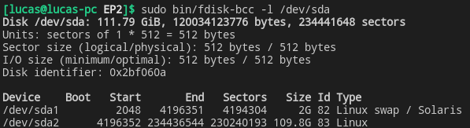

# Senac BCC fdisk

## Problem

Given a file with 512 bytes, if it represents an MBR, your program should generate an output equivalent to that of the fdisk command.

Output of fdisk command:
```console
[lucas@lucas-pc EP2]$ sudo fdisk -l /dev/sda 
Disk /dev/sda: 111.79 GiB, 120034123776 bytes, 234441648 sectors
Disk model: Corsair Force LE
Units: sectors of 1 * 512 = 512 bytes
Sector size (logical/physical): 512 bytes / 512 bytes
I/O size (minimum/optimal): 512 bytes / 512 bytes
Disklabel type: dos
Disk identifier: 0x02bf060a

Device     Boot   Start       End   Sectors   Size Id Type
/dev/sda1          2048   4196351   4194304     2G 82 Linux swap / Solaris
/dev/sda2       4196352 234436544 230240193 109.8G 83 Linux
```

## Resolution

```console
[lucas@lucas-pc EP2]$ sudo bin/fdisk-bcc -l /dev/sda
Disk /dev/sda: 111.79 GiB, 120034123776 bytes, 234441648 sectors
Units: sectors of 1 * 512 = 512 bytes
Sector size (logical/physical): 512 bytes / 512 bytes
I/O size (minimum/optimal): 512 bytes / 512 bytes
Disk identifier: 0x2bf060a

Device    Boot   Start       End   Sectors   Size Id Type
/dev/sda1         2048   4196351   4194304     2G 82 Linux swap / Solaris
/dev/sda2      4196352 234436544 230240193 109.8G 83 Linux
```

Resolution image:  


## References

- [Alexandru-Paul Copil: MBR, LBA, FAT32](https://cpl.li/posts/2019-03-12-mbrfat/)
- [MBR (x86)](https://wiki.osdev.org/MBR_%28x86%29)
- [Master boot record](https://en.wikipedia.org/wiki/Master_boot_record)
- [Partition type](https://en.wikipedia.org/wiki/Partition_type)
- [Byte: Multiple-byte_units](https://en.wikipedia.org/wiki/Byte#Multiple-byte_units)